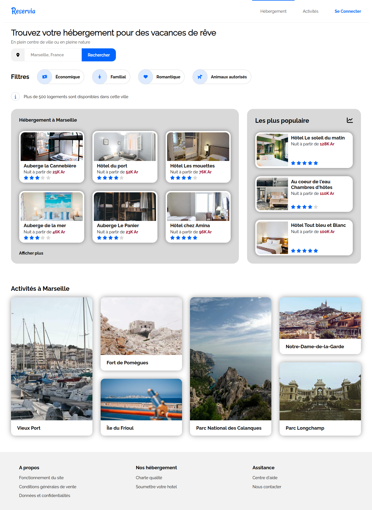
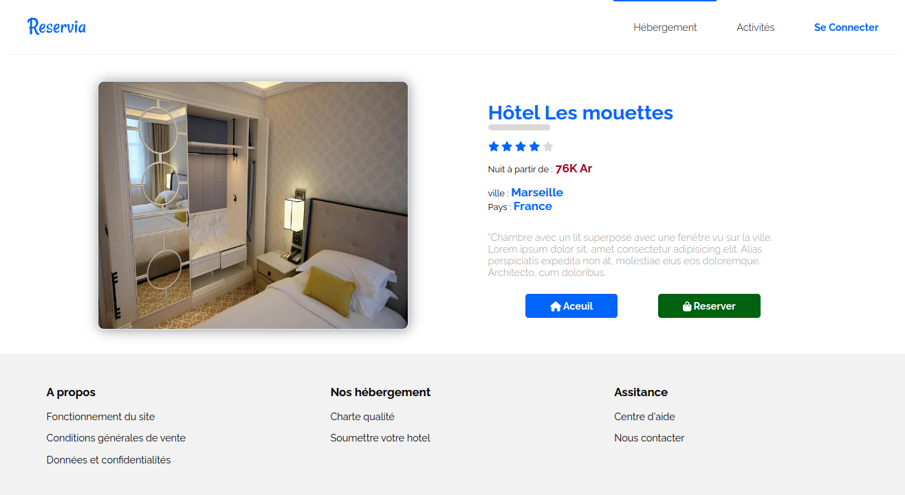
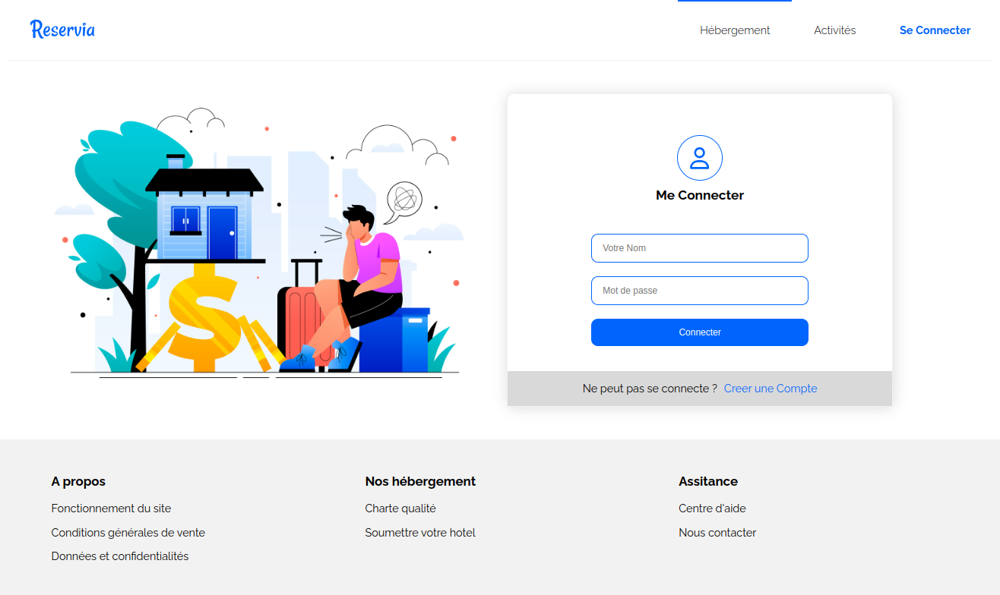
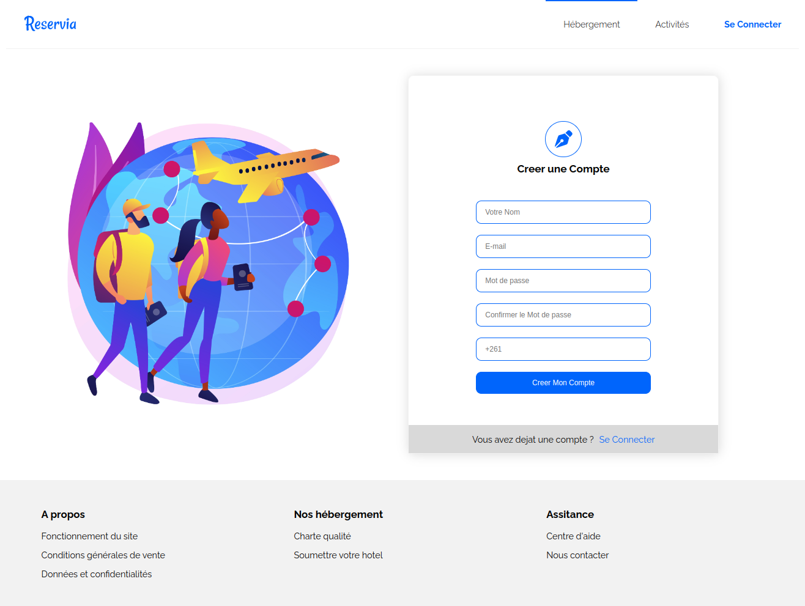
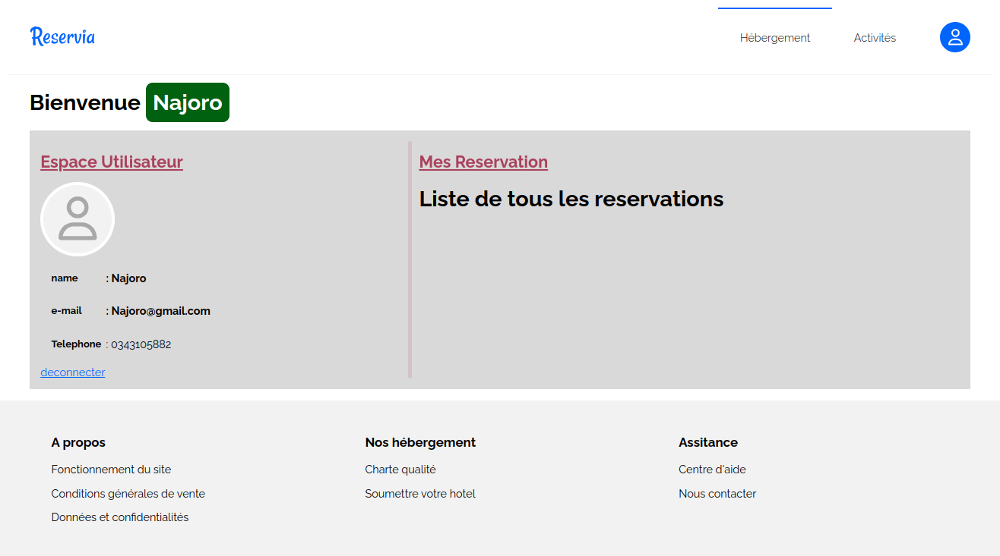

# RESERVIA PROJECT

## Instructions d'exécution

Pour exécuter ce projet, suivez ces étapes :

1. Clônez le dépôt sur votre machine locale :

    ```
    git clone https://github.com/Najoro/Reservia.git
    ```

2. Accédez au répertoire du projet :

    ```
    cd ./Reservia
    ```

4. Lancez l'application :

    ```
    php -S localhosh:8000 -t ./Www
    ```


## Apprecue de l'application

### acceuil


### chaque chambre


### ecpace Login


### ecpace inscription


### ecpace Authentification



